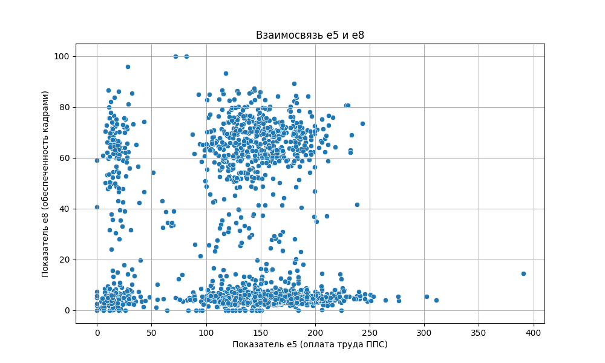
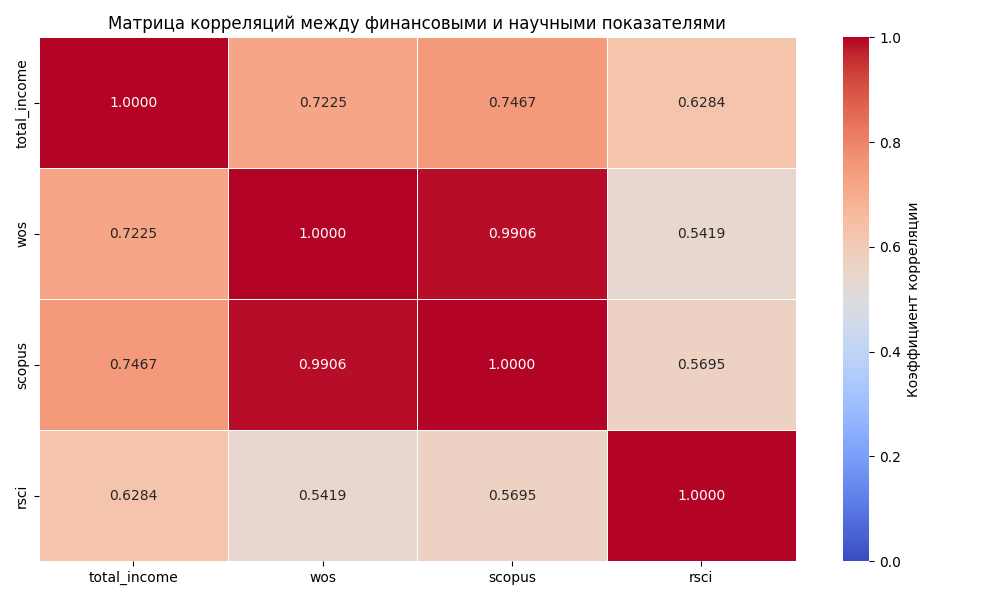
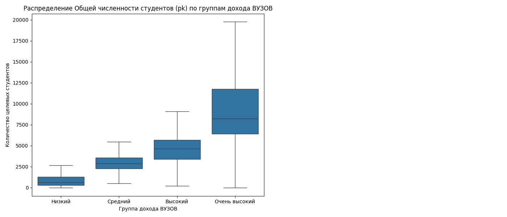
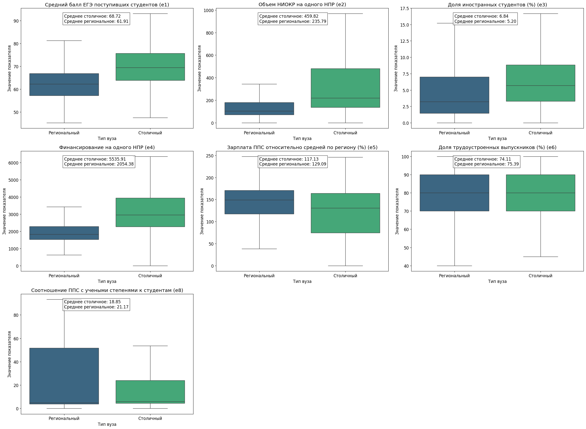

> # Модуль Статистика: Итоговый проект

## Основные цели проекта:

* Практическое освоение методов статистического анализа.

# 1. Данные и пердварительная подготовка 
## Описание данных:
Источник: https://data.rcsi.science/data-catalog/datasets/169/

Набор данных  представляет собой ГЕНЕРАЛЬНУЮ СОВОКУПНОСТЬ  и содержит основные показатели результативности деятельности всех российских организаций высшего образования (за исключением негосударственных вузов и филиалов) за 2013-2017 годы. 

Эти данные опубликованы в целях  мониторинга эффективности деятельности организаций высшего образования Минобрнауки РФ. 

В рамках представленного  датасета, данные  были приведены к более удобному для машинной обработки формату (панельные данные в формате плоской таблицы).

Единица наблюдения в наборе (строка): организация высшего образования (университет) за определенный год. Для каждого наблюдения представлены следующие атрибуты:

* федеральный округ, регион, ОКАТО региона, к которому относится организация    высшего образования;
* показатели, отражающие результативность образовательной,научно-исследовательской деятельности вуза, а также некоторые характеристики его инфраструктуры.

Набор охватывает все доступные сведения за 2013-2017 гг. 
Всего набор содержит 2 564 наблюдений по 27 атрибутам.


### Обзор показателей отражающих результатаивность

#### e1 
 Отношение суммы средних баллов ЕГЭ студентов, принятых на обучение по очной форме обучения по результатам ЕГЭ или по результатам ЕГЭ и дополнительных испытаний за исключением лиц, принятых по результатам целевого приема, по всем направлениям и специальностям программ бакалавриата и специалитета, умноженных на численность таких студентов, обучающихся по соответствующим направлениям и специальностям программ бакалавриата и специалитета, к суммарной численности таких студентов. Результаты студентов, имеющих право на прием без вступительных испытаний, признаются как наивысшие результаты ЕГЭ (100 баллов) по соответствующим общеобразовательным предметам	

####  e2
Отношение общего объема средств, поступивших за отчетный год от выполнения НИОКР* к численности НПР*. 
*(НИОКР-Научно-исследовательские и опытно-конструкторские работы , 
НПР-Научно-педагогические работники)

#### e3
Отношение приведенного контингента студентов – граждан иностранных государств, к приведенному контингенту студентов (кроме студентов, обучающихся на специальностях, на которые не предусмотрен прием иностранных граждан), выраженное в процентах

#### e4
Отношение объема средств организации, поступивших за отчетный год из бюджетных и внебюджетных источников, без учета собственных средств, к численности НПР

#### e5
Отношение фонда начисленной заработной платы работников профессорско-преподавательского состава, к среднесписочной численности таких работников, деленное на 12 и деленное на соответствующую среднемесячную начисленную заработную плату наемных работников в организациях, у индивидуальных предпринимателей и физических лиц (среднемесячный доход от трудовой деятельности) в субъекте Российской Федерации, выраженное в процентах


#### e6
Отношение численности трудоустроившихся в течение календарного года, следующего за годом выпуска, выпускников образовательной организации высшего образования, к общей численности выпускников образовательной организации года, предшествующего отчетному, обучавшихся по очной форме обучения по программам бакалавриата, программам специалитета, программам ординатуры/интернатуры и получавших образование данного уровня впервые (первое высшее образование), вне зависимости от основы обучения, за исключением продолживших обучение и (или) являющихся иностранными гражданами, выраженное в процентах	

#### e8
Отношение приведенной к числу ставок численности работников ППС, имеющих ученую степень доктора наук или кандидата наук, к численности студентов, обучающихся по программам бакалавриата, специалитета и магистратуры


#### ege_budg

Средний балл ЕГЭ студентов, принятых по результатам ЕГЭ на обучение по очной форме по программам бакалавриата и специалитета за счет средств соответствующих бюджетов бюджетной системы РФ	


#### wos
Число публикаций организации, индексируемых в информационно-аналитической системе научного цитирования Web of Science, в расчете на 100 НПР		


#### scopus
Число публикаций организации, индексируемых в информационно-аналитической системе научного цитирования Scopus, в расчете на 100 НПР	


#### rsci
Число публикаций организации, индексируемых в информационно-аналитической системе научного цитирования РИНЦ, в расчете на 100 НПР	


#### rnd	
Общий объем научно-исследовательских и опытно-конструкторских работ	(тыс.руб)


#### total_income 
Доходы вуза из всех источников	(тыс.руб)

#### square	
Общая площадь учебно-лабораторных помещений	(м2)


#### phd_share
Удельный вес численности обучающихся (приведенного контингента) подготовки научно-педагогических кадров в аспирантуре (адъюнктуре), ординатуры, ассистентуры-стажировки в общей численности приведенного контингента обучающихся по основным образовательным программам высшего образования	


#### pps	

Общая численность ППС

### rnd_private	
Доходы от НИОКР (за исключением средств бюджетов бюджетной системы Российской Федерации, государственных фондов поддержки науки)	(тыс.руб)

#### pk
Общая численность студентов (приведенный контингент)

### Атрибуты

#### federal_district_short	
Сокращенное наименование Федерального округа

#### region_name		
Субъект РФ			
			

#### id		
Идентификационный номер образовательной организации			

#### name_short		
Короткое наименование образовательной организации			

#### year		
Год	

## Загрузка датафрейма и предварительная очистка данных 

```python

import pandas as pd
# Чтение CSV файла
df = pd.read_csv('data.csv', sep=';', encoding='utf-8')
# Просмотр названий столбцов
df.columns
# Удаление ненужных столбцов
df.drop(['federal_district', 'okato', 'region_code', 'name'], axis=1, inplace=True)
```

# 2.Формирование гипотез 

Исходя из анализа  показателей харрактерезующих результативность,  которые описывают ключевые  аспекты  деаятельности учебного  заведения, 
выдвигаемые гепотезы  так же  направлены на оценку ключевых  аспектов деятельности образовательного учреждения.

* 2.1 **Гипотеза по качеству образования** 
Университеты с более высоким показателем оплаты труда ППС (e5) показывают лучшие результаты по обеспеченности кадрами с учеными степенями (e8).

* 2.2 **Гипотеза по научной деятельности** 
Финансовые ресурсы вуза выраженные в доходах (total_income) оказывают прямое влияние на показатели научной продуктивности, 
измеряемые через количество публикаций в ведущих научных базах данных (wos, scopus, rsci).

* 2.3 **Гипотеза о финансовой привлекательности**
Чем выше общий доход вуза, тем больше количество обучающихся в нём студентов.

* 2.4 **Гипотеза отражающие региональные особенности**
Показатели эффективности столичных вузов статистически значимо отличаются от показателей региональных вузов по одной или нескольким метрикам.

# 3. Проверка  выдвигаемых гипотез

## 2.1 Университеты с более высоким показателем оплаты труда ППС (e5) показывают лучшие результаты по обеспеченности кадрами с учеными степенями (e8)

```python
import pandas as pd
import matplotlib.pyplot as plt
import seaborn as sns

# Проверка корреляции
correlation = df['e5'].corr(df['e8'])
print(f'Коэффициент корреляции: {correlation:.4f}')

# Интерпретация силы связи
if abs(correlation) < 0.3:
    strength = "слабая"
elif abs(correlation) < 0.7:
    strength = "умеренная"
else:
    strength = "сильная"

print(f"Сила связи между показателями: {strength}")

# Визуализация взаимосвязи
plt.figure(figsize=(10, 6))
sns.scatterplot(x='e5', y='e8', data=df)
plt.title('Взаимосвязь e5 и e8')
plt.xlabel('Показатель e5 (оплата труда ППС)')
plt.ylabel('Показатель e8 (обеспеченность кадрами)')
plt.grid(True)
plt.savefig('e5e8.png')
plt.show()
```


``` 
Коэффициент корреляции: 0.0102
Сила связи между показателями: слабая 
```





## Выводы:

**Гипотеза не подтверждается**

* Связь  между показателями слабая 
* Повышение оплаты труда ППС само по себе не гарантирует увеличение количества кадров с учеными степенями

* Вероятно существуют другие факторы, которые сильнее влияют на привлечение и удержание квалифицированных кадров

Некоторые вероятные факторы :

* Наличие жилья для преподавателей

* Возможности для научной работы

* Репутация университета

* Географическое расположение

* Возможности карьерного роста  


## 2.2 Финансовые ресурсы вуза выраженные в доходах (total_income) оказывают прямое влияние на показатели научной продуктивности, измеряемые через количество публикаций в ведущих научных базах данных (wos, scopus, rsci).


``` python

import pandas as pd
import matplotlib.pyplot as plt
import seaborn as sns

# Группируем данные по id университета  и считаем средние значения 
grouped_data = df.groupby('id').agg({
    'total_income': 'mean',
    'wos': 'mean',
    'scopus': 'mean',
    'rsci': 'mean'
}).reset_index()

# Анализ корреляций
correlations = grouped_data[['total_income', 'wos', 'scopus', 'rsci']].corr()

# Визуализация
plt.figure(figsize=(10, 6))
sns.heatmap(
    correlations,
    annot=True,
    cmap='coolwarm',
    fmt=".4f",
    linewidths=0.5,
    cbar_kws={'label': 'Коэффициент корреляции'},
    vmin=0,
    vmax=1
)
plt.title('Матрица корреляций между финансовыми и научными показателями')
plt.tight_layout()
plt.savefig('total_income.png', dpi=300)
plt.show()
```





## Выводы:

**Гипотеза подтверждается**

Подтверждено прямое,  положительное влияние финансовых ресурсов  выраженных в показателе total_income (Доходы вуза из всех источников) на научную продуктивность которая  выражается  в кол-ве научных публикаций в международных (WoS, Scopus) и российской (RSCI) базах данных.


Результаты проверки гипотезы:
Финансовые ресурсы вуза оказывают следующее влияние:
- На публикационную активность в WoS: коэффициент корреляции = 0.7225 ,    Степень влияния: сильное
- На публикационную активность в Scopus: коэффициент корреляции = 0.7467 , Степень влияния: сильное
- На публикационную активность в RSCI: коэффициент корреляции = 0.6284 ,   Степень влияния: умеренное

## 2.3 Чем выше общий доход вуза, тем больше количество обучающихся в нём студентов.
``` python
import pandas as pd
import matplotlib.pyplot as plt
import seaborn as sns

# Создаем группы доходов вузов (разбиваем на квантили)
df['income_group'] = pd.qcut(
    df['total_income'], 
    q=4, 
    labels=['Низкий', 'Средний', 'Высокий', 'Очень высокий']
)

# Описательная статистика по группам для pk
group_stats = df.groupby('income_group')['pk'].describe()

# Визуализация распределения pk по группам
plt.figure(figsize=(16, 6))
plt.subplot(1, 2, 1)
sns.boxplot(
    data=df,
    x='income_group',
    y='pk',
    order=['Низкий', 'Средний', 'Высокий', 'Очень высокий'],
    showfliers=False
)
plt.title('Распределение Общей численности студентов (pk) по группам дохода ВУЗОВ')
plt.xlabel('Группа дохода ВУЗОВ')
plt.ylabel('Количество целевых студентов')

plt.tight_layout()
plt.savefig('pk.png')
plt.show()

# Сохраняем таблицу в HTML
with open('stats_table.html', 'w') as f:
    f.write(group_stats.to_html())
```

### Описательная статистика по группам для pk

| Параметр    | count | mean      | std        | min    | 25%     | 50%     | 75%     | max     |
|-------------|-------|-----------|------------|--------|---------|---------|---------|---------|
| **income_group** |         |            |            |        |         |         |         |         |
| Низкий      | 641.0 | 849.80    | 691.43     | 7.30    | 294.0   | 642.80  | 1274.15 | 5991.55 |
| Средний     | 641.0 | 2906.72   | 1028.65    | 116.05  | 2288.3  | 2903.30 | 3596.90 | 5744.40 |
| Высокий     | 641.0 | 4551.88   | 1664.26    | 196.00  | 3412.1  | 4654.45 | 5694.40 | 10031.20|
| Очень высокий| 641.0 | 9608.05   | 5072.37    | 10.50   | 6408.0  | 8211.25 | 11782.75| 33241.70|




## Выводы:

**Гипотеза подтверждается**

Визуальное подтверждение тренда на графике.

Больший доход позволяет,  расширять материально-техническую базу ВУЗа, увеличить число образовательшых программ, предоставлять  стипенидии  и т.д


## 2.4 Показатели эффективности столичных вузов статистически значимо отличаются от показателей региональных вузов по одной или нескольким метрикам.

``` python 

import pandas as pd
import numpy as np
import matplotlib.pyplot as plt
import seaborn as sns

# Создаем признак "тип вуза"
df['type'] = np.where(
    df['region_name'].str.contains('Москва|Московская область|Санкт-Петербург|Ленинградская область'),
    'Столичный',
    'Региональный'
)

# Предварительная обработка данных
df_clean = df.dropna(subset=['type', 'e1', 'e2', 'e3', 'e4', 'e5', 'e6', 'e8'])

# Словарь с названиями показателей
metric_names = {
    'e1': 'Средний балл ЕГЭ поступивших студентов (e1)',
    'e2': 'Объем НИОКР на одного НПР (e2)',
    'e3': 'Доля иностранных студентов (%) (e3)',
    'e4': 'Финансирование на одного НПР (e4)',
    'e5': 'Зарплата ППС относительно средней по региону (%) (e5)',
    'e6': 'Доля трудоустроенных выпускников (%) (e6)',
    'e8': 'Соотношение ППС с учеными степенями к студентам (e8)'
}

# Настройка стиля графиков
plt.rcParams.update({'font.size': 12})
plt.figure(figsize=(16, 12))

# Создание панели графиков
for i, metric in enumerate(metric_names.keys(), 1):
    plt.subplot(3, 3, i)
    
    # Боксплот без выбросов
    sns.boxplot(
        x='type',
        y=metric,
        hue='type',  # Добавляем hue
        data=df_clean,
        palette='viridis',
        showfliers=False,  # Отключаем отображение выбросов
        legend=False  # Убираем легенду
    )
    
    # Добавление сводной статистики
    plt.title(f'{metric_names[metric]}')
    plt.xlabel('Тип вуза')
    plt.ylabel('Значение показателя')
    
    # Расчет средних значений
    mean_capital = df_clean[df_clean['type'] == 'Столичный'][metric].mean()
    mean_regional = df_clean[df_clean['type'] == 'Региональный'][metric].mean()
    
    # Добавление аннотаций
    plt.text(
        0.25, 
        0.88, 
        f'Среднее столичное: {mean_capital:.2f}\n'
        f'Среднее региональное: {mean_regional:.2f}',
        transform=plt.gca().transAxes,
        fontsize=12,
        bbox=dict(facecolor='white', alpha=0.7)
    )

plt.tight_layout(rect=(0, 0.03, 1.5, 1.5))
plt.savefig('all.png')
plt.show()
```
#
### Сравнение показателей столичных и региональных вузов
#





## Выводы:

**Гипотеза подтверждается**

Выявлено наличие статистически значимых различий между показателями столичных и региональных вузов по ряду ключевых показателей.
Подтверждена гипотеза о том, что показатели эффективности вузов различаются в зависимости от их территориального расположения.
По большинству исследуемых показателей средние значения для столичных вузов статистически значимо выше
